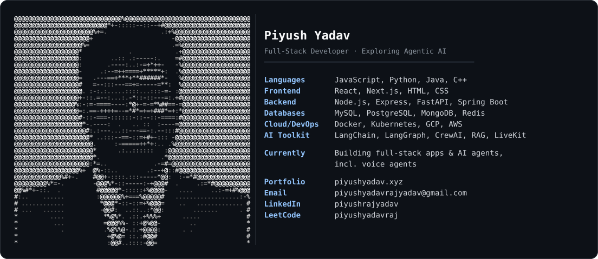

<div align="center">



<br/>

<a href="https://git.io/typing-svg">
  
</a>

<p>
  <a href="https://piyushyadav.xyz" target="_blank">
    
  </a>
  <a href="https://linkedin.com/in/piyushrajyadav" target="_blank">
    
  </a>
  <a href="mailto:piyushyadavrajyadav@gmail.com">
    
  </a>
  <a href="https://medium.com/@piyushrajyadav28" target="_blank">
    
  </a>
</p>


</div>

---

<div align="center">

## 🎭 About Me

</div>

```typescript
interface Developer {
  name: string;
  role: string;
  location: string;
  passions: string[];
  focusAreas: string[];
  learning: string[];
  askMeAbout: string[];
}

const piyush: Developer = {
  name: "Piyush Yadav",
  role: "Full Stack Developer & AI Engineer",
  location: "Kolkata, India 🇮🇳",
  passions: ["Agentic AI Systems", "Voice AI", "Scalable Backend Architecture"],
  focusAreas: ["Multi-Agent Orchestration", "Voice Agents", "RAG Pipelines", "Cloud-Native Deployment"],
  learning: ["Generative AI", "Kubernetes", "Web3 Technologies"],
  askMeAbout: ["React", "Next.js", "Node.js", "LangGraph", "CrewAI", "LiveKit", "DevOps"]
};
```

<div align="center">

🔗 **[Explore My Portfolio](https://piyushyadav.xyz)** • 📄 **[Download Resume](https://docs.google.com/document/d/16849msQFX6Z0Nhl62HmqUkd-sE8DhxNV/edit?usp=sharing&ouid=105421290837773712140&rtpof=true&sd=true)**

</div>

---

<div align="center">

## 💻 What I Build

</div>

<table>
<tr>
<td width="50%">

**🏗️ Full-Stack Software**
- End-to-end web apps with **React / Next.js** on the frontend and **Node.js, Express, FastAPI, Spring Boot** on the backend
- RESTful API design, database modeling (**MySQL, PostgreSQL, MongoDB, Redis**), and clean auth/validation patterns
- Containerized, cloud-deployed systems on **Docker, Kubernetes, GCP, AWS**

</td>
<td width="50%">

**🤖 Agentic & Voice AI**
- Multi-agent orchestration with **CrewAI** and **LangGraph** — pipelines that plan, reason, and produce real outputs
- Real-time voice agents built on **LiveKit**, with conversation state managed as LangGraph state machines
- Retrieval-augmented generation (**RAG**) and LLM integration into production systems

</td>
</tr>
<tr>
<td colspan="2">

**⚙️ Toolkit**: `React` `Next.js` `Node.js` `FastAPI` `Spring Boot` `Docker` `Kubernetes` — plus `LangChain` `LangGraph` `CrewAI` `RAG` `LiveKit` `LLM Integration`

I like working across the whole stack — solid backend and infra fundamentals, with a growing focus on agentic and voice-driven AI systems layered on top.

</td>
</tr>
</table>

<div align="center">

*Full-stack fundamentals, agentic ambitions* 🚀

</div>

---

<div align="center">

## 🧠 Tech Arsenal

</div>

<details open>
<summary><b>🎨 Frontend Craftsmanship</b></summary>
<br>


</details>

<details open>
<summary><b>⚙️ Backend Engineering</b></summary>
<br>


</details>

<details open>
<summary><b>🗄️ Database & Storage</b></summary>
<br>


</details>

<details open>
<summary><b>🤖 AI / Agentic Frameworks</b></summary>
<br>


</details>

<details open>
<summary><b>☁️ DevOps & Cloud Native</b></summary>
<br>


</details>

---

<div align="center">

## 🏆 Coding Journey

</div>

<div align="center">
  
</div>

<div align="center">

### 📊 LeetCode Statistics


<a href="https://leetcode.com/piyushyadavraj/">
  
</a>

</div>

---

<div align="center">

## 📝 Latest from My Blog

</div>

<!-- BLOG-POST-LIST:START -->
<!-- BLOG-POST-LIST:END -->

<div align="center">

<a href="https://medium.com/@piyushrajyadav28">
  
</a>

</div>

---

<div align="center">

## 📈 GitHub Analytics

</div>

<div align="center">
  
  
</div>

<div align="center">
  
</div>

<div align="center">
  
</div>

---

<div align="center">

## 🏆 Holopin Badges

[](https://holopin.io/@piyushrajyadav)

</div>

---

<div align="center">

## 🌐 Connect & Collaborate

</div>

<div align="center">

<a href="https://twitter.com/piyushyada49189">
  
</a>
<a href="https://linkedin.com/in/piyushrajyadav">
  
</a>
<a href="https://medium.com/@piyushrajyadav28">
  
</a>
<a href="https://instagram.com/piyushyadav_raj">
  
</a>
<a href="https://leetcode.com/piyushyadavraj">
  
</a>
<a href="https://auth.geeksforgeeks.org/user/piyushrajyadav">
  
</a>
<a href="https://kaggle.com/piyushyadavraj">
  
</a>

</div>

---

<div align="center">

### 💭 Developer Wisdom


### 😄 Debug Break - Have a Laugh!


---


**⭐ Star my repositories if you find them interesting!**

*"Code is like humor. When you have to explain it, it's bad."* – Cory House

</div>
